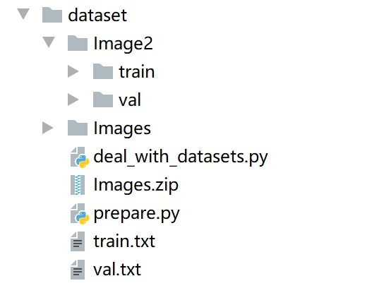

# 激活函数以及数据集的训练
## 激活函数
常见激活函数的优缺点
https://blog.csdn.net/JiangKangbo/article/details/146567332
```python
import torch
import torchvision
from torch.utils.data import DataLoader
from torch.utils.tensorboard import SummaryWriter

# 导入数据集
dataset = torchvision.datasets.CIFAR10(root="dataset_chen",
                                       train=False,
                                       transform=torchvision.transforms.ToTensor())
dataloader = DataLoader(dataset=dataset,
                        batch_size=64)

# 设置input
input = torch.tensor([[1, -0.5],
                      [-1, 3]])
input = torch.reshape(input, (-1, 1, 2, 2))
print(input.shape)


# 非线性激活网络
class Chen(torch.nn.Module):
    def __init__(self):
        super().__init__()
        self.relu = torch.nn.ReLU()
        self.sigmoid = torch.nn.Sigmoid()

    def forward(self, input):
        output = self.sigmoid(input)
        return output


chen = Chen()

writer = SummaryWriter("sigmod_logs")
step = 0
for data in dataloader:
    imgs, targets = data
    writer.add_images("input", imgs, global_step=step)
    output_sigmod = chen(imgs)
    writer.add_images("output", output_sigmod, global_step=step)
    step += 1
writer.close()

output = chen(input)
print(output)

```
尝试使用resnet，Googlenet，mobileNet，moganet 等不同模型跑图片分类
尝试使用GPU训练网络模型
## 训练自己的数据集
数据集预处理，新建工程项目
deal_with_datasets.py
```python
import os
import shutil
from sklearn.model_selection import train_test_split
import random

# 设置随机种子以确保可重复性
random.seed(42)

# 数据集路径
dataset_dir = r'D:\Desktop\tcl\dataset\image2'  # 替换为你的数据集路径
train_dir = r'D:\Desktop\tcl\dataset\image2\train'  # 训练集输出路径
val_dir = r'D:\Desktop\tcl\dataset\image2\val'  # 验证集输出路径

# 划分比例
train_ratio = 0.7

# 创建训练集和验证集目录
os.makedirs(train_dir, exist_ok=True)
os.makedirs(val_dir, exist_ok=True)

# 遍历每个类别文件夹
for class_name in os.listdir(dataset_dir):
    if class_name not in ["train","val"]:
        class_path = os.path.join(dataset_dir, class_name)


        # 获取该类别下的所有图片
        images = [f for f in os.listdir(class_path) if f.endswith(('.jpg', '.jpeg', '.png'))]
        # 确保图片路径包含类别文件夹
        images = [os.path.join(class_name, img) for img in images]

        # 划分训练集和验证集
        train_images, val_images = train_test_split(images, train_size=train_ratio, random_state=42)

        # 创建类别子文件夹
        os.makedirs(os.path.join(train_dir, class_name), exist_ok=True)
        os.makedirs(os.path.join(val_dir, class_name), exist_ok=True)

        # 复制训练集图片
        for img in train_images:
            src = os.path.join(dataset_dir, img)
            dst = os.path.join(train_dir, img)
            shutil.move(src, dst)

        # 复制验证集图片
        for img in val_images:
            src = os.path.join(dataset_dir, img)
            dst = os.path.join(val_dir, img)
            shutil.move(src, dst)

	        shutil.rmtree(class_path)
```
prepare.py
```python
### prepare.py

import os

# 创建保存路径的函数
def create_txt_file(root_dir, txt_filename):
    # 打开并写入文件
    with open(txt_filename, 'w') as f:
        # 遍历每个类别文件夹
        for label, category in enumerate(os.listdir(root_dir)):
            category_path = os.path.join(root_dir, category)
            if os.path.isdir(category_path):
                # 遍历该类别文件夹中的所有图片
                for img_name in os.listdir(category_path):
                    img_path = os.path.join(category_path, img_name)
                    f.write(f"{img_path} {label}\n")

create_txt_file(r'D:\Desktop\tcl\dataset\image2\train', 'train.txt')
create_txt_file(r'D:\Desktop\tcl\dataset\image2\val', "val.txt")
```
最后效果展示
